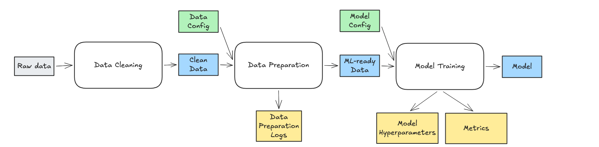
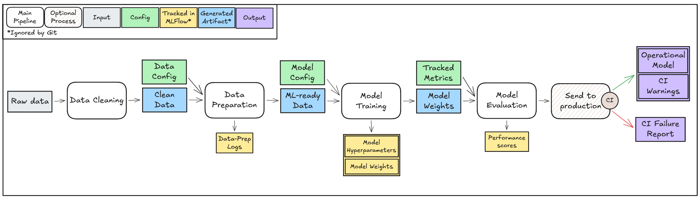
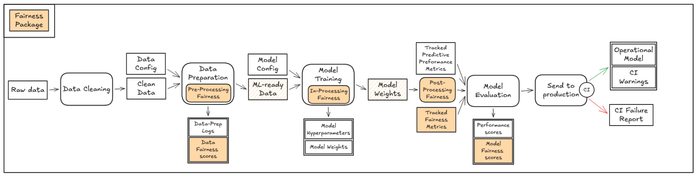
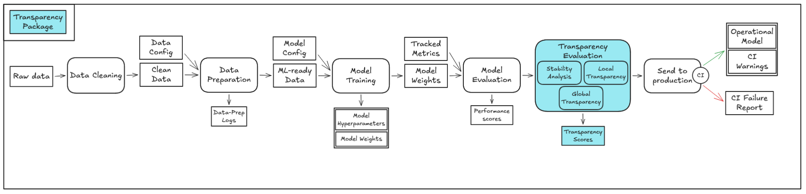

# fates-proxy-usecase
Use of well-known fair-classification public dataset as an example for FATES-MLOps project process of continuously tracking Fairness, Accountability, Transparency, Ethics and Safety requirements in an ML application.

## Table of contents
- [Installation](#installation)
- [Configuration](#configuration)
- [Usage](#usage)
- [Tracking](#tracking)

## Installation

Poetry is required to install the python environnement with the right dependencies.

Once you have poetry installed, just use :

``poetry install --no-root``

You should now have a ".venv" python with the right dependencies to run any code in this repository.

## Configuration

All the code will read the config files in the ``config/`` folder. 
You can use ``data_config.yaml`` for the data preparation, and ``model_config.yaml`` to tune the hyper parameters, the model type and the metrics you want to track.

## Usage

You can use the ``Makefile`` to run the scripts.
The main script to run is ``pipeline.py``, it will track the process using MLFlow. 

``clean_and_prepare_data.py``, ``split_data.py`` and ``model_training.py`` are scripts you can use to focus on a specific part of the pipeline. 
Using these scripts, the process is not tracked by MLFlow.

If you want to check the state of the tracking, use ``poetry run mlflow ui``

## Tracking

When you run the pipeline, many logs are tracked in order to reproduce and compare the iteration with others.
During the data preparation, we track parameters such as the test sample size.
During the model training, we track the hyperparameters in order to reproduce the training.
After the model training, we track the metrics in order to compare multiple models.

## WIP

### Justifications and Continuous Integration to test a model to be on production

Implementation of a CI process to test justifications described with JPipe Justification Diagrams.

### Fairness Package

Implementation of optional fairness process and evaluation in order to justify fairness constraints according to justifications to be tested on CI.

### Transparency Package

Implementation of optional transparency evaluation in order to justify transparency constraints according to justifications to be tested on CI.

