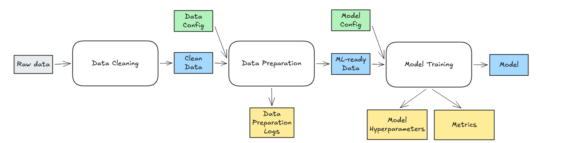
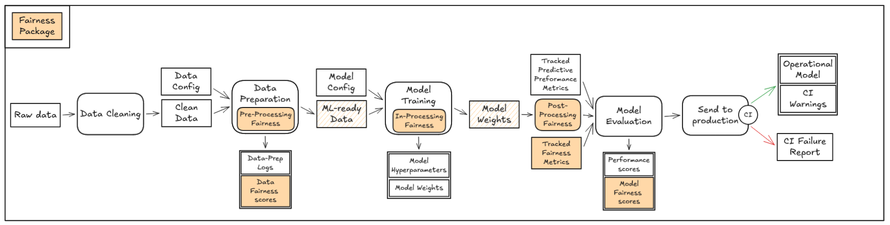

# fates-proxy-usecase

Use of well-known fair-classification public dataset as an example for FATES-MLOps project process of continuously tracking Fairness, Accountability, Transparency, Ethics and Safety requirements in an ML application.

## Table of contents
- [Installation](#installation)
- [Configuration](#configuration)
- [Usage](#usage)
- [Tracking](#tracking)

## Installation

Poetry is required to install the python environnement with the right dependencies.

Once you have poetry installed, just use :

``poetry install --no-root``

You should now have a ".venv" python with the right dependencies to run any code in this repository.

## Configuration

The code will rely on the config file in the ``config/`` folder. 

## Usage

You can use the ``Makefile`` to run the scripts.
The main script to run is ``pipeline.py``, it will use the data to train a model according to the config, and track the process using MLFlow. 

To check the state of the tracking, use ``poetry run mlflow ui``

## Tracking

During the data preparation, we track parameters such as the test sample size.
Before the model training, we track the model hyperparameters.
After the model training, we track metrics in order to compare multiple models.

## CI

The pipeline produces artifacts such as a model weights file. 
The ``justification/`` folder includes justification diagrams that will define the criteria to pass the continuous integration.
The active justification diagram is referenced in the config.
Once you push new code, justification is test with github actions to ensure that the criteria remain always valid.

## Fairness

Fairness process and evaluation are available in order to justify fairness constraints according to justifications to be tested on CI.

## WIP

### Transparency Package

Implementation of optional transparency evaluation in order to justify transparency constraints according to justifications to be tested on CI.

